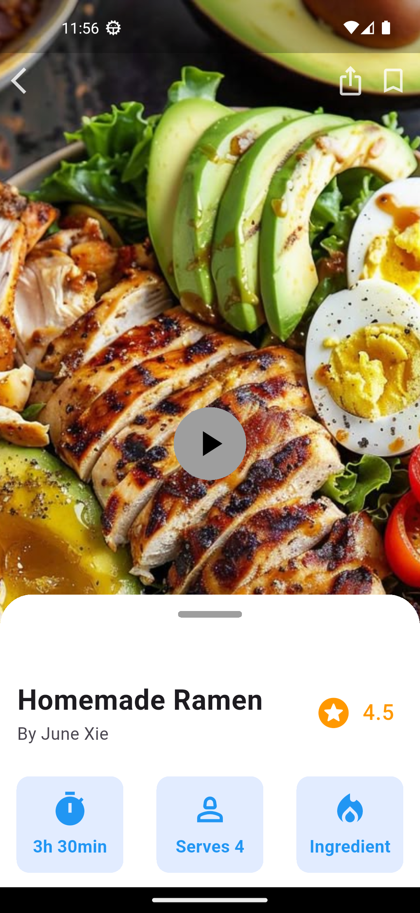
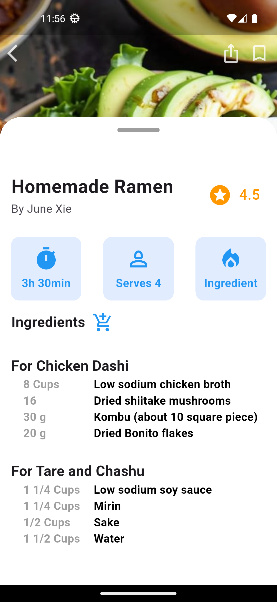

# Task 08 - IEEE-CS-MOBILE-26

This project is **Task 08** for the IEEE-CS Mobile Track.

## 📱 Task Overview

A Flutter UI application that recreates a recipe screen with a draggable bottom sheet.

## 📸 Screenshots





## 🚀 Getting Started

This is a Flutter project.

### Requirements
- Flutter SDK
- Android Studio or VS Code

### Run the project

```bash
flutter pub get
flutter run
