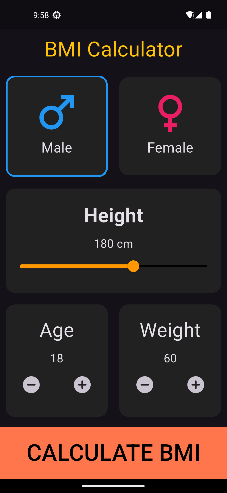
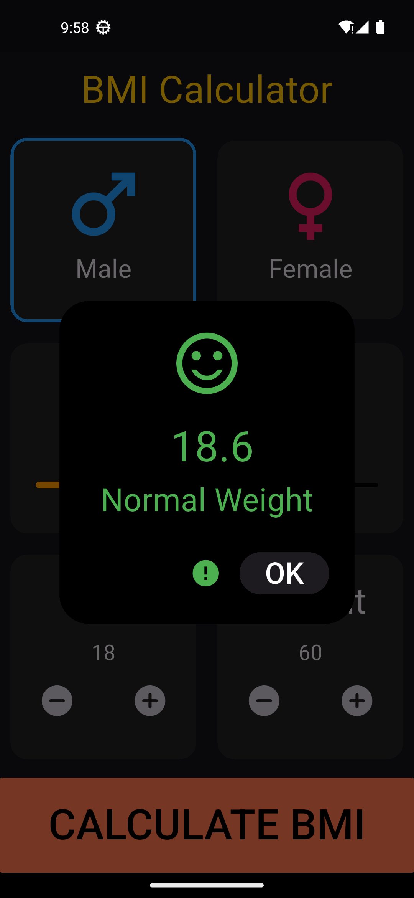
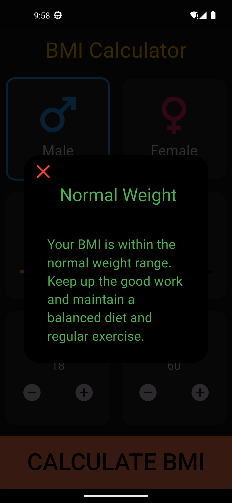

# Task 09 - IEEE-CS-MOBILE-26

This project is **Task 09** for the IEEE-CS Mobile Track.

## 📱 Task Overview

A Flutter application that calculates **Body Mass Index (BMI)** based on user input (gender, height, weight, and age).

The app provides:

- Interactive UI for input
- BMI calculation
- Result classification (Underweight, Normal, Overweight, Obese)
- Detailed health message

## 📸 Screenshots







## 🚀 Getting Started

This is a Flutter project.

### Requirements

- Flutter SDK
- Android Studio or VS Code
- Emulator or physical device

### Run the project

```bash
flutter pub get
flutter run
```
