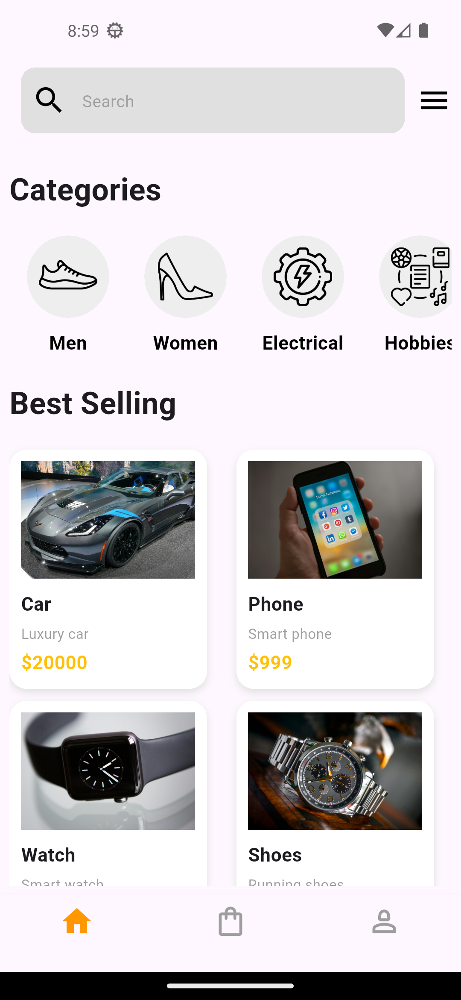
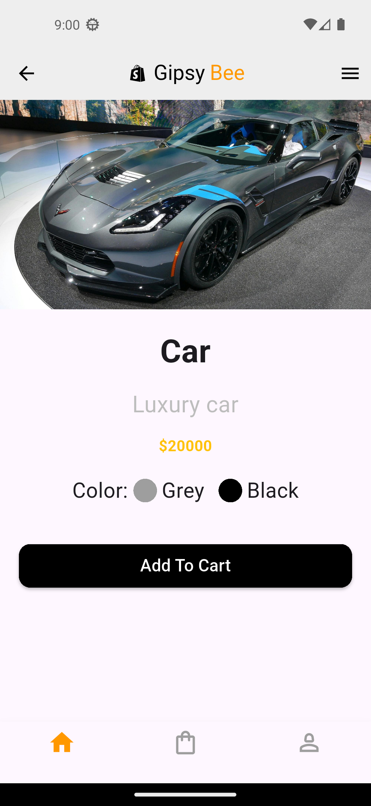

# Task 10 - IEEE-CS-MOBILE-26

This project is **Task 10** for the IEEE-CS Mobile Track.

## 📱 Task Overview

A Flutter UI application that recreates two pages of a simple e-commerce.

## 📸 Screenshots





## 🚀 Getting Started

This is a Flutter project.

### Requirements

- Flutter SDK
- Android Studio or VS Code

### Run the project

```bash
flutter pub get
flutter run
```
