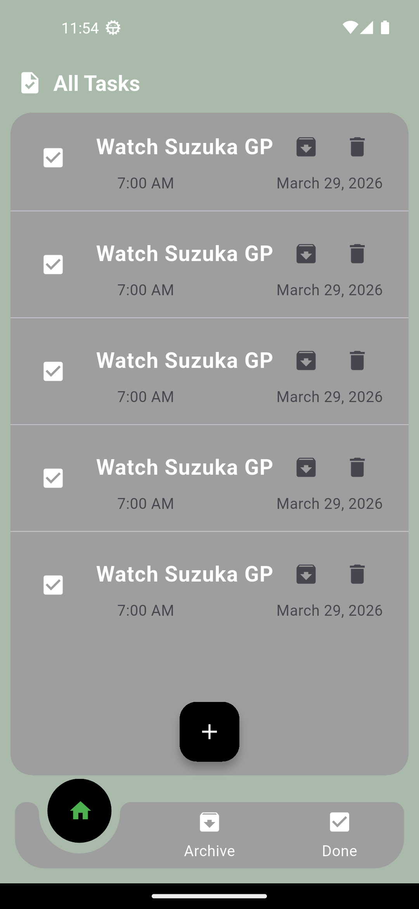
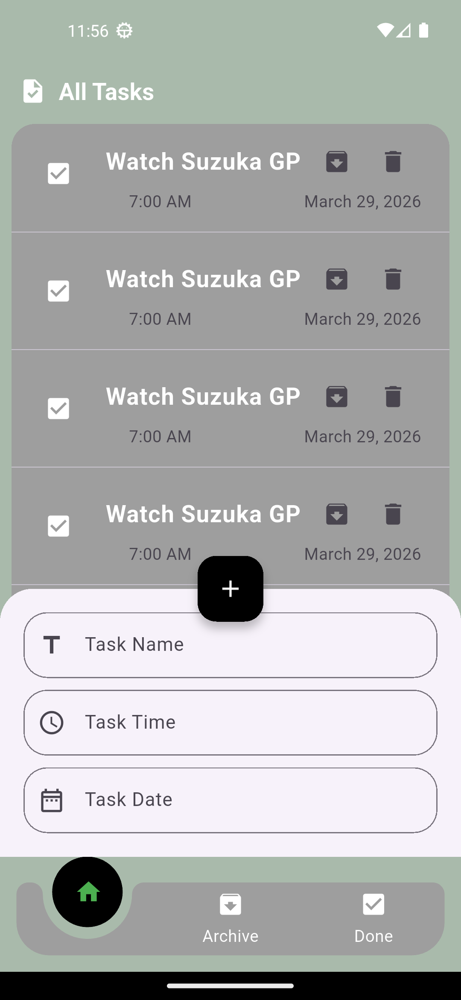
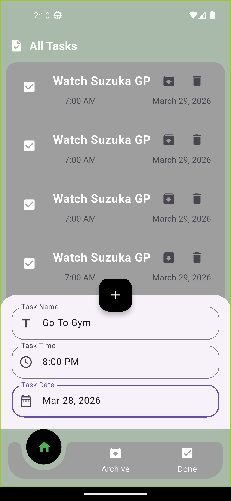

# Task 11 - IEEE-CS-MOBILE-26

This project is **Task 11** for the IEEE-CS Mobile Track.

## 📱 Task Overview

A Flutter application for managing daily tasks with a clean UI.

Features include:

- Adding new tasks using a bottom sheet
- Selecting date and time
- Viewing tasks list
- Simple task management UI

## 📸 Screenshots







## 🚀 Getting Started

This is a Flutter project.

### Requirements

- Flutter SDK
- Android Studio or VS Code
- Emulator or physical device

### Run the project

```bash
flutter pub get
flutter run
```
