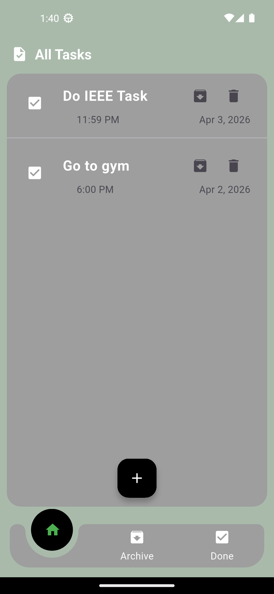

# 📱 Task 11 & 12 - IEEE-CS-MOBILE-26

This project is part of the **IEEE-CS Mobile Track**.

It covers:
- **Task 11** → UI & basic task management
- **Task 12** → Local database integration using sqflite

---

## 📌 Overview

A Flutter application for managing daily tasks with a clean and simple UI.

The app allows users to:
- Add tasks
- Select date and time
- Store tasks locally
- View saved tasks even after restarting the app

---

## ✨ Features

### ✅ Task 11 (UI & Logic)
- Add new tasks using a bottom sheet
- Pick date and time
- Display tasks in a list
- Clean and responsive UI

### 🗄️ Task 12 (sqflite Database)
- Store tasks locally using **sqflite**
- Insert tasks into the database
- Retrieve and display saved tasks
- Persistent storage (data is saved after app restart)

> ⚠️ **Note:** Update and delete features are not implemented yet.

---

## 📸 Screenshots

### 🧾 Tasks Screen


### ➕ Bottom Sheet


### 📝 Adding Task


### 🗃️ Tasks From Database


---

## 🚀 Getting Started

### Requirements
- Flutter SDK
- Android Studio or VS Code
- Emulator or Physical Device

### Run the Project

```bash
flutter pub get
flutter run
